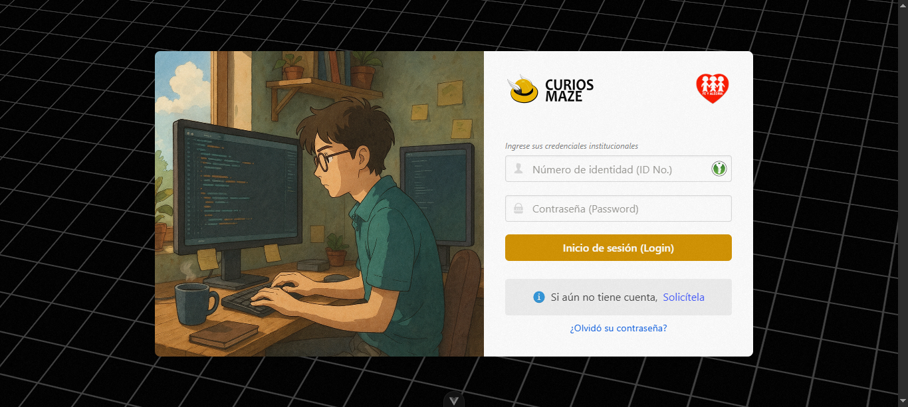
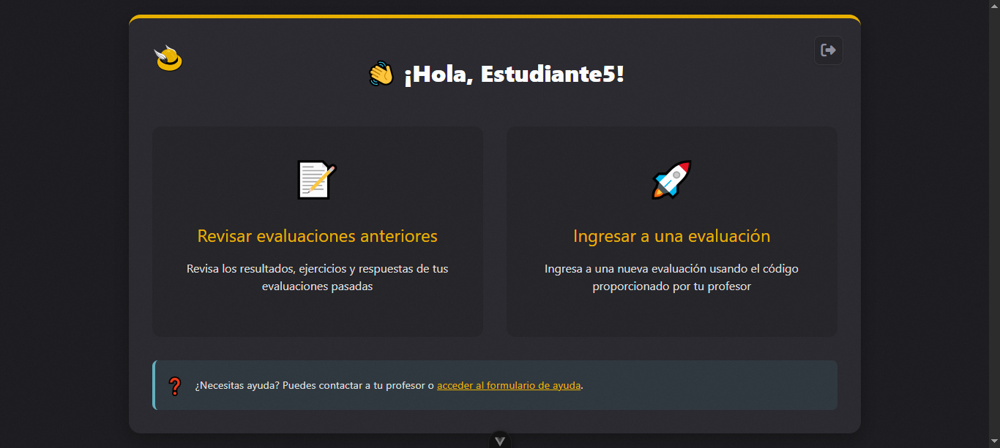
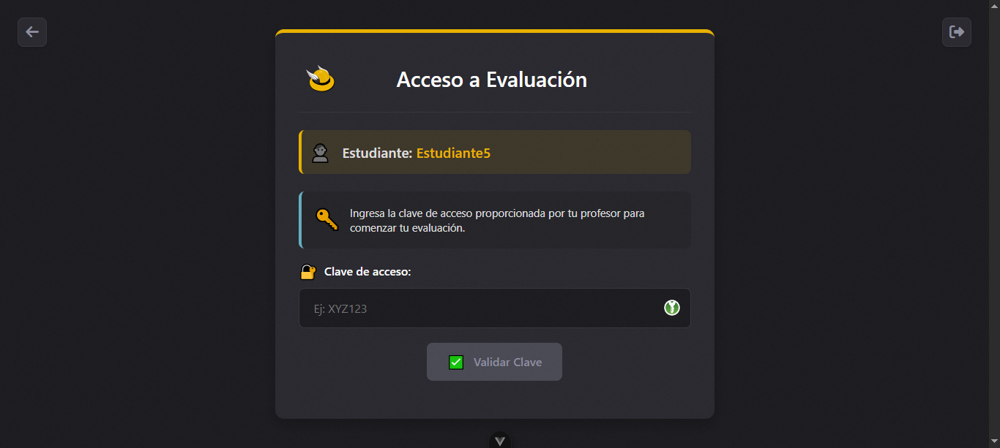
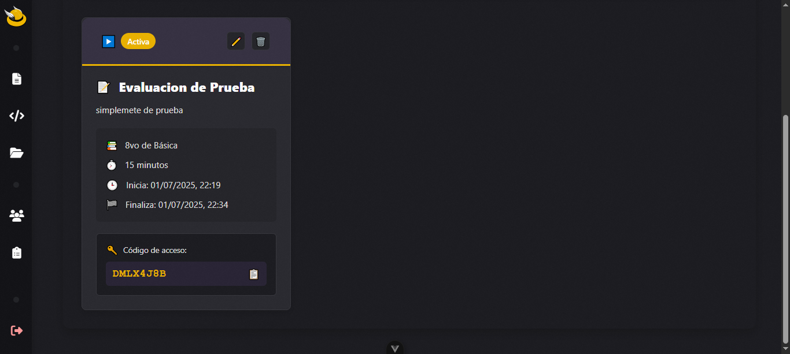
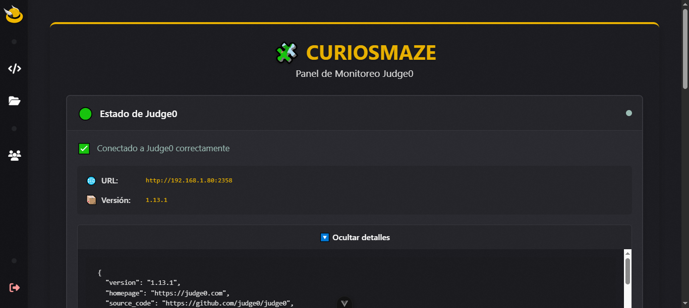
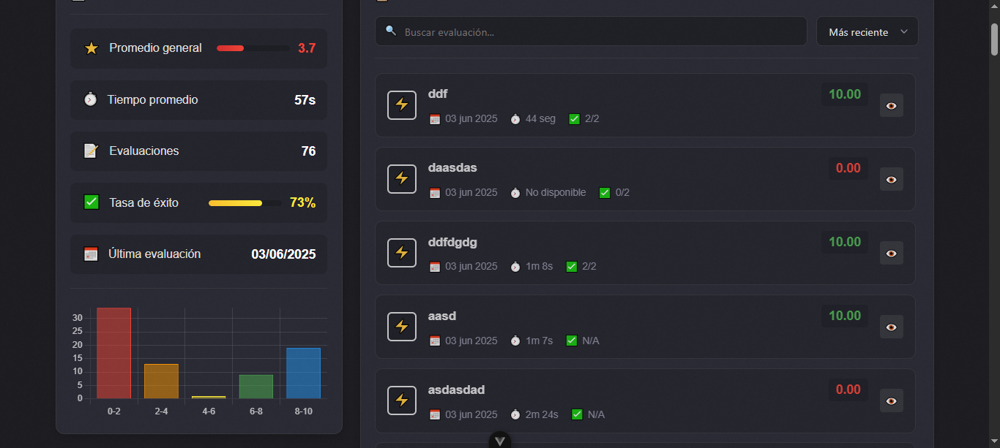
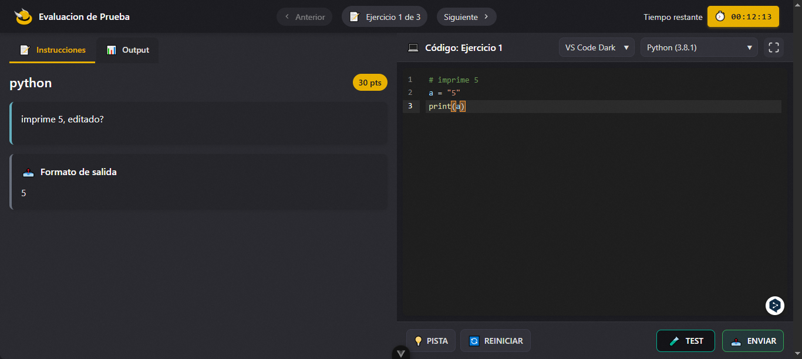
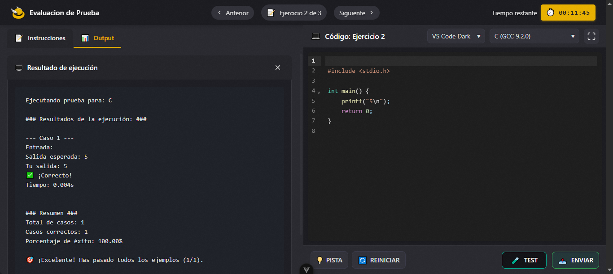
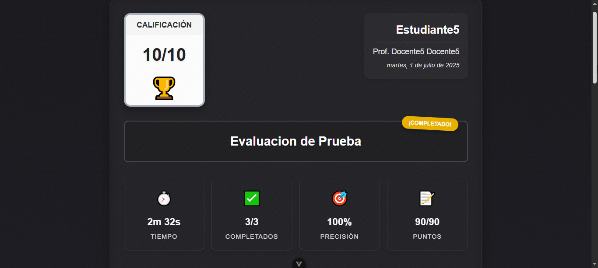

# CURIOSMAZE

  

  
  
  
  
  

**CURIOSMAZE** es una plataforma web educativa para el desarrollo del pensamiento lógico y la evaluación automática de ejercicios de programación 

La plataforma permite crear evaluaciones interactivas con ejercicios de programación en Python, los cuales son evaluados automáticamente mediante un sistema de ejecución de código (Judge0) que proporciona retroalimentación inmediata.

## 🔧 Arquitectura tecnológica

La plataforma está construida siguiendo una arquitectura cliente-servidor:

| Componente | Tecnología | Descripción |
|------------|------------|-------------|
| **Frontend** | Vue.js 3 | Interfaz de usuario moderna y reactiva |
| **Backend** | Django REST | API para gestión de datos |
| **Ejecución de código** | Judge0 | Sistema externo para ejecución segura de código |
| **Base de datos** | SQLite (desarrollo) | Almacenamiento de datos (configurable para PostgreSQL en producción) |

### Requisitos previos

- Python 3.8+
- Node.js 14+
- Judge0 (instalado en un servidor separado)

## 📷 Capturas de CURIOSMAZE

Algunas capturas de la plataforma en funcionamiento.

<strong>Capturas</strong>

## ⚙️ Archivos de inicio y configuración

A continuación se describen los scripts incluidos para facilitar la configuración y ejecución del proyecto en entornos de desarrollo:

| Archivo | Descripción |
|--------|-------------|
| `dev-start.bat` | Este script configura e inicia **CURIOSMAZE** en modo desarrollo, ejecutando el servidor backend y el frontend por separado. |
| `setup-curiosmaze.bat` | Script de configuración automática que realiza lo siguiente:  &nbsp;&nbsp;• Crea archivos `.env` para el frontend y backend  &nbsp;&nbsp;• Instala dependencias de Node.js  &nbsp;&nbsp;• Construye el frontend (`dist/`)  &nbsp;&nbsp;• Configura el entorno del backend (entorno virtual, instalación de dependencias)  &nbsp;&nbsp;• Ejecuta migraciones de Django. |
| `start-curiosmaze.bat` | Inicia automáticamente el servidor **frontend** y el **backend**. |
| `verify-curiosmaze.bat` | Verifica que la plataforma esté correctamente configurada. |

### Configuración de Judge0

CURIOSMAZE usa un servidor Judge0 para la ejecución de código. Puedes encontrar instrucciones detalladas para su instalación en [la documentación oficial de Judge0](https://github.com/judge0/judge0/blob/master/README.md).

Una vez configurado, actualiza la URL de Judge0 en los archivos `.env` tanto del backend como del frontend.

## 🔒 Autenticación y roles

CURIOSMAZE implementa un sistema de autenticación basado en roles:

- **Administrador**: Gestión completa del sistema
- **Docente**: Creación de evaluaciones, gestión de estudiantes, revisión de resultados
- **Estudiante**: Acceso a evaluaciones, realización de ejercicios, visualización de resultados

