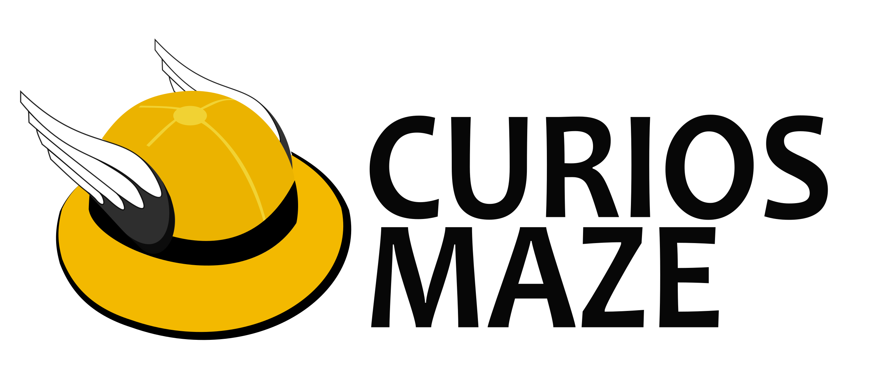

# CURIOSMAZE
<p align="center">
  
</p>

<p align="center">
  
  
  
  
  
</p>

**CURIOSMAZE** es una plataforma web educativa para el desarrollo del pensamiento lógico y la evaluación automática de ejercicios de programación 

La plataforma permite crear evaluaciones interactivas con ejercicios de programación en Python, los cuales son evaluados automáticamente mediante un sistema de ejecución de código (Judge0) que proporciona retroalimentación inmediata.


## 🔧 Arquitectura tecnológica

La plataforma está construida siguiendo una arquitectura cliente-servidor:

| Componente | Tecnología | Descripción |
|------------|------------|-------------|
| **Frontend** | Vue.js 3 | Interfaz de usuario moderna y reactiva |
| **Backend** | Django REST | API robusta para gestión de datos |
| **Ejecución de código** | Judge0 | Sistema externo para ejecución segura de código |
| **Base de datos** | SQLite (desarrollo) | Almacenamiento de datos (configurable para PostgreSQL en producción) |


### Requisitos previos

- Python 3.8+
- Node.js 14+
- Judge0 (instalado en un servidor separado)

### Configuración del Backend

```bash
# Clonar el repositorio
git clone https://github.com/tu-usuario/curiosmaze.git
cd curiosmaze/curiosmaze_backend

# Crear entorno virtual
python -m venv venv
source venv/bin/activate  # En Windows: venv\Scripts\activate

# Instalar dependencias
pip install -r requirements.txt

# Configurar variables de entorno
cp .env.example .env
# Editar .env con tus configuraciones

# Migraciones
python manage.py migrate

# Crear superusuario
python manage.py createsuperuser

# Ejecutar servidor
python manage.py runserver
```

### Configuración del Frontend

```bash
# Navegar al directorio frontend
cd ../frontend

# Instalar dependencias
npm install

# Configurar variables de entorno
cp .env.example .env
# Editar .env con tus configuraciones

# Ejecutar en modo desarrollo
npm run dev
```

### Configuración de Judge0

CURIOSMAZE usa un servidor Judge0 para la ejecución de código. Puedes encontrar instrucciones detalladas para su instalación en [la documentación oficial de Judge0](https://github.com/judge0/judge0/blob/master/README.md).


Una vez configurado, actualiza la URL de Judge0 en los archivos `.env` tanto del backend como del frontend.

## 🔒 Autenticación y roles

CURIOSMAZE implementa un sistema de autenticación basado en roles:

- **Administrador**: Gestión completa del sistema
- **Docente**: Creación de evaluaciones, gestión de estudiantes, revisión de resultados
- **Estudiante**: Acceso a evaluaciones, realización de ejercicios, visualización de resultados

## 📝 Licencia

Este proyecto está licenciado bajo la **GNU Affero General Public License v3.0** (AGPL-3.0).

**Derechos y condiciones**:
- ✅ Uso, distribución y modificación permitidos.
- ✅ Todo trabajo derivado debe mantenerse bajo la misma licencia AGPL-3.0.
- ✅ Si se ofrece este software como servicio web, también se debe proveer el código fuente.
- ❌ No está permitido el uso con fines comerciales sin autorización expresa del autor.

Consulta el texto completo de la licencia aquí: [https://www.gnu.org/licenses/agpl-3.0.html](https://www.gnu.org/licenses/agpl-3.0.html)

### Nota sobre Judge0

CURIOSMAZE utiliza Judge0 como sistema externo para la ejecución de código. Judge0 está licenciado bajo la GNU General Public License v3.0 (GPL-3.0).
No se ha modificado el código fuente de Judge0 y se utiliza exclusivamente como un servicio separado autoalojado.

## 🎓 Proyecto de Tesis

CURIOSMAZE es un proyecto desarrollado como parte de una tesis académica para la Unidad Educativa Juan Pablo II, con el objetivo de mejorar la enseñanza de programación en estudiantes de bachillerato mediante herramientas tecnológicas interactivas.

---

<p align="center">
  © 2025 Martin Mayanquer. Todos los derechos reservados bajo los términos de la AGPL v3.0.
</p>